# Pink Theme - Female Model

These screenshots show the current pre-MVP UI using the pink theme and female body model.

[Back to screenshot gallery](../README.md)

| Screen | Preview |
| --- | --- |
| Homepage | 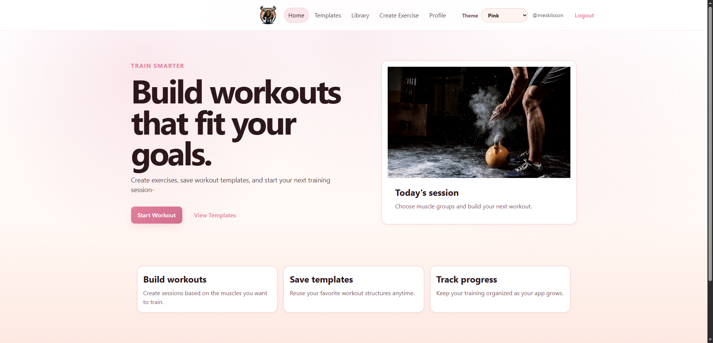 |
| Exercise Library | 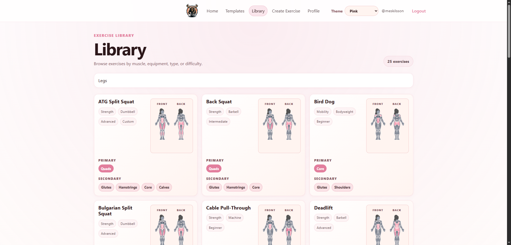 |
| Muscle Group Selection | 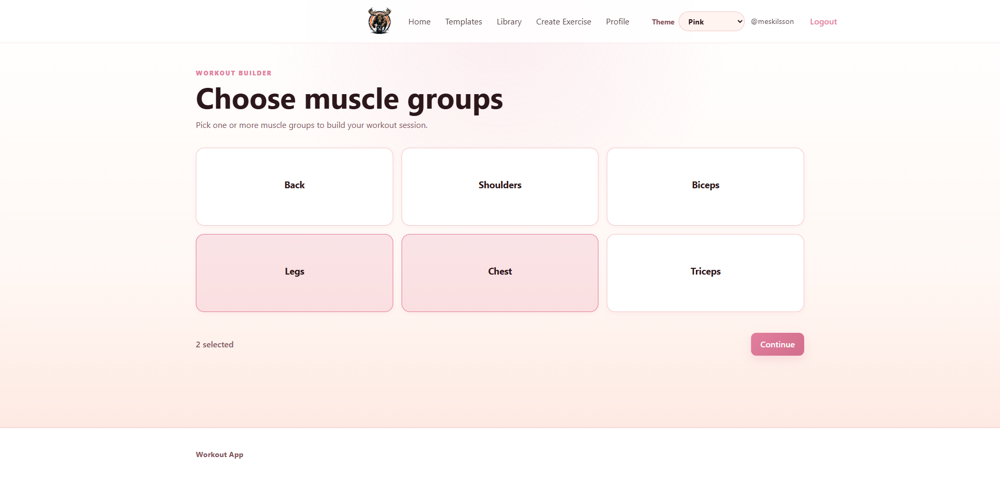 |
| Exercise Selection | 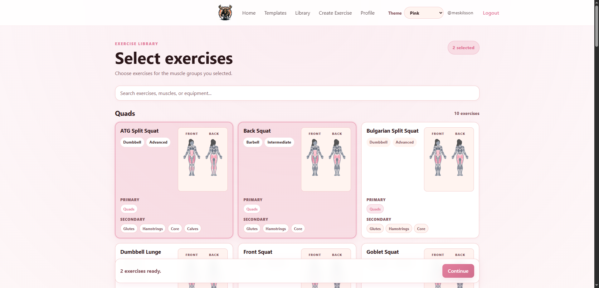 |
| Workout Summary | 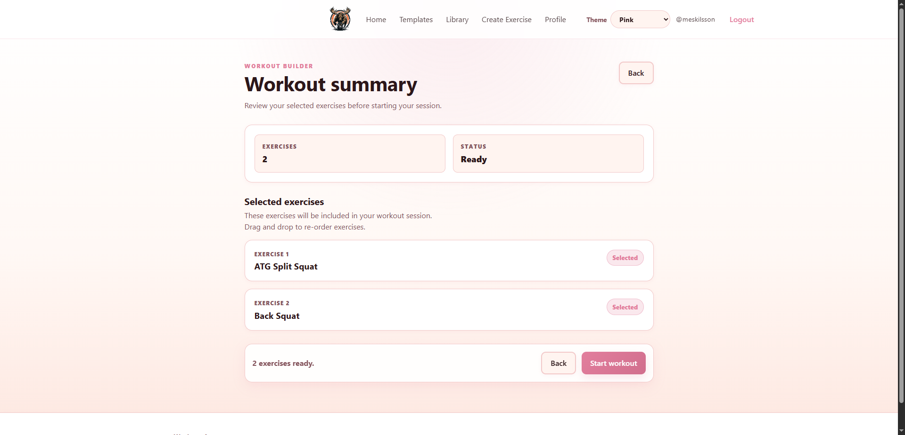 |
| Workout Summary End | 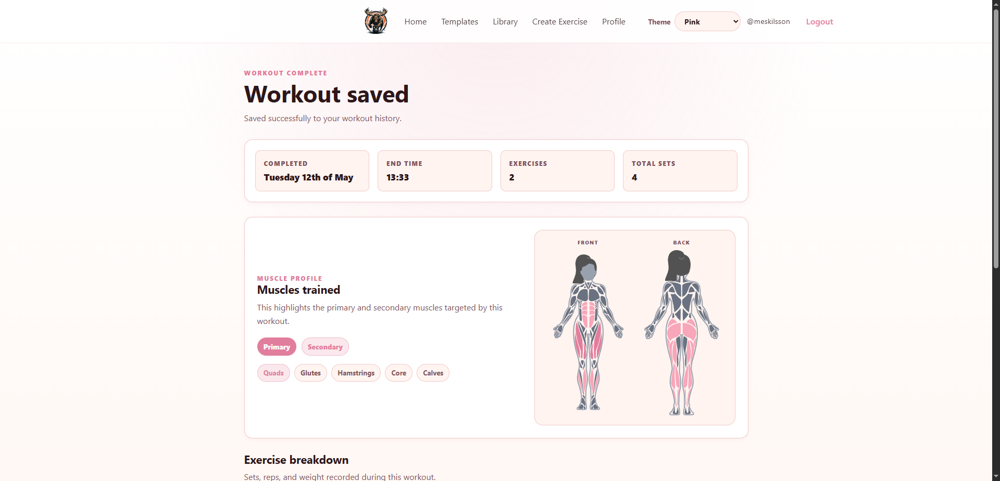 |
| Workout Summary End Continued | 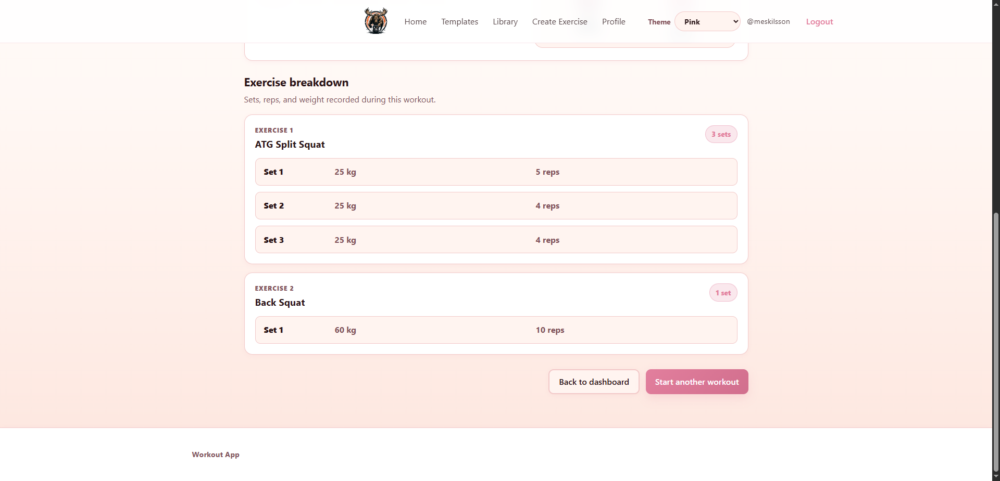 |
| Active Workout | 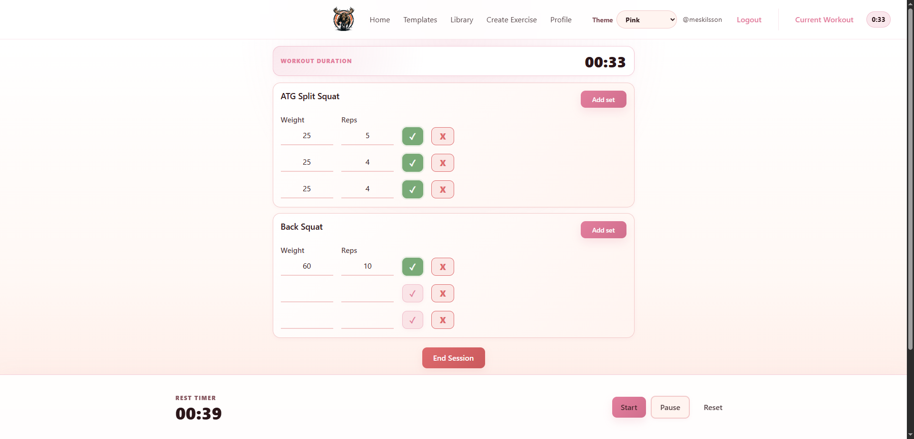 |
| Profile | 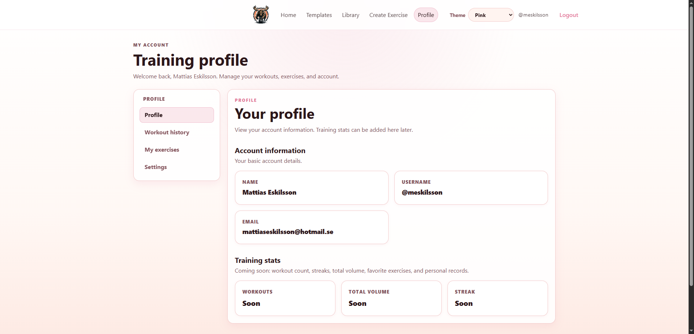 |
| Workout History | 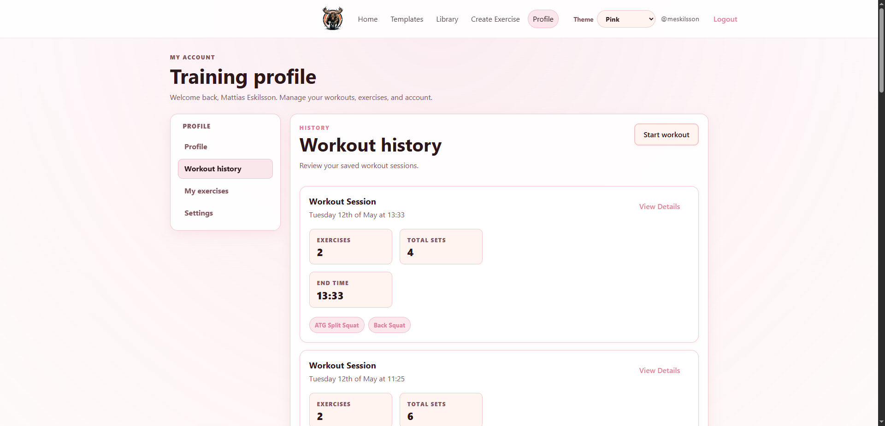 |
| Workout History Details | 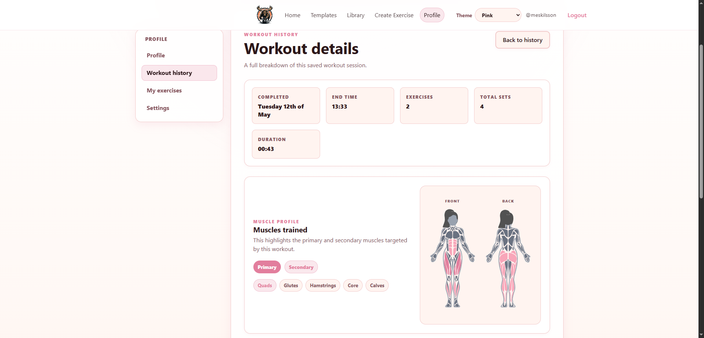 |
| Workout History Details Continued | 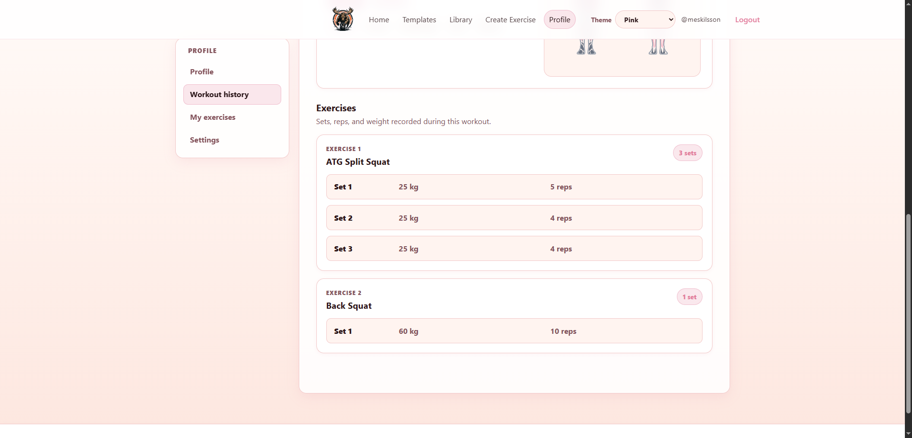 |
